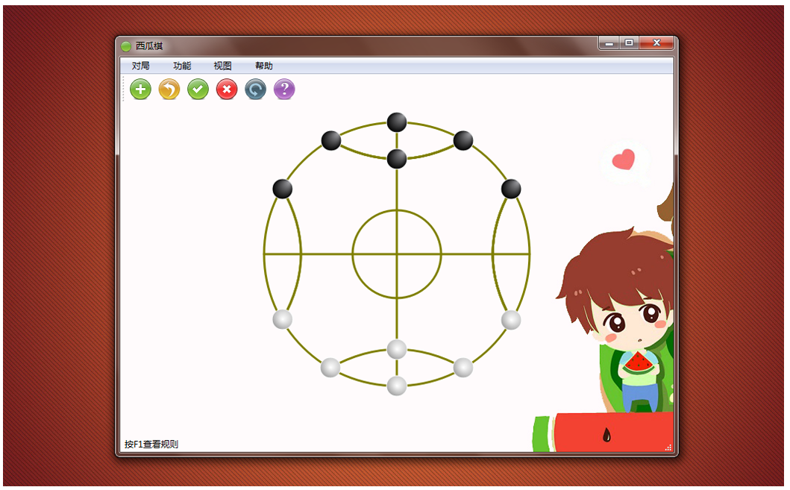

## 西瓜棋 Watermelon Chess

<!--  -->

<!-- ### 支持 Support   

- windows xp/7/8/10

### 下载 Download

- 安装程序：[watermelon-chess-1.6.1-install.exe](https://github.com/tatwd/watermelon-chess/raw/master/wiki/downloads/watermelon-chess-1.6.1-install.exe)

- 源代码包：[watermelon-chess-1.6.1-source.zip](https://github.com/tatwd/watermelon-chess/raw/master/wiki/downloads/watermelon-chess-1.6.1-src.zip)

### 版本 Version
    
- 1.6.1-Beta -->

```
cd src && qmake && ./wchess
```

Or using [Qt Creator](https://www.qt.io/product/development-tools) to build it.


